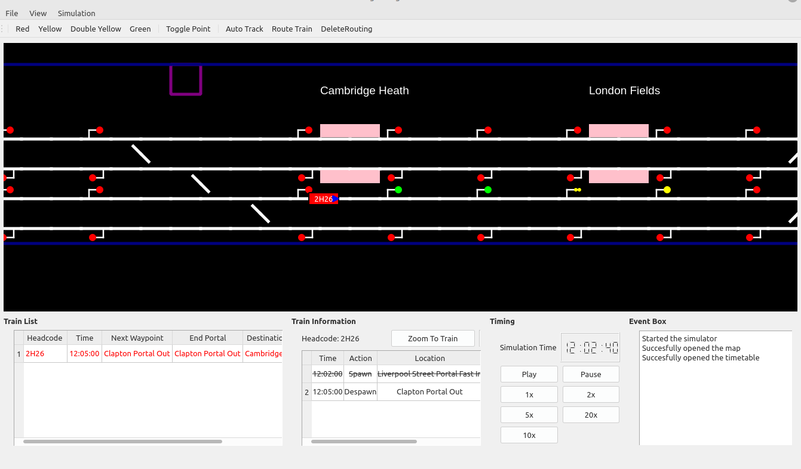

# SignallingSimulator
The Railway Signalling Simulator is an interactive application designed to emulate the complexities of railway signaling. Users can load maps and associated timetables to simulate real-world train operations, control signals and points, and manage train routes effectively. This project is a **work in progress** but is already in a usable state. Contributions and feedback are welcome as the project evolves.

## Features

- Simulates railway signalling systems with ability to control points and signals.
- Software built in python for ultimate portability.
- Map Editor allows users to create new scenarios easily.



## Installation

- Ensure you have [Python 3.x](https://www.python.org/downloads/) installed.
- Install the required dependencies by running: `pip install PyQt5`
- Run the program with the following commands:
 ```
  git clone https://github.com/yourusername/SignallingSimulator.git
  cd SignallingSimulator/SignallingSimulator
  python3 mainSignal.py
```
## Known Issues
- Some signalling behaviors need further testing.
- The map editor has some missing features.
- Bugs with auto track and route train.

## Roadmap
- Implement more interesting maps and scenarios.
- Make sure the number of bugs are reduced.
- Add a bridge tile for more map possibilities.
